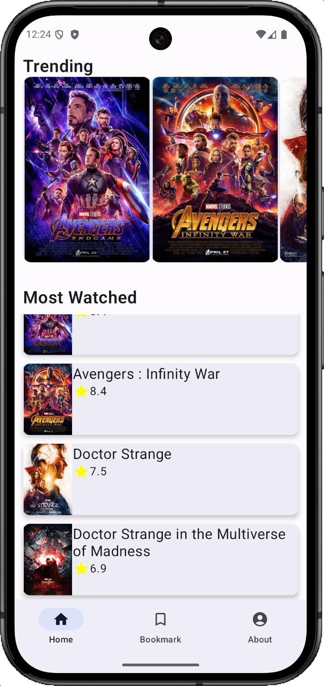
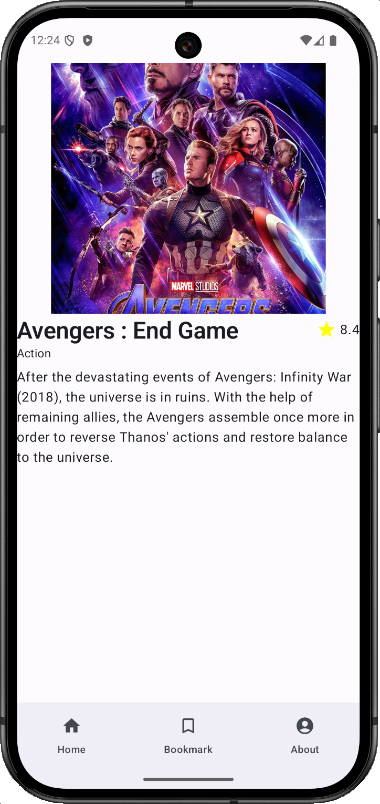
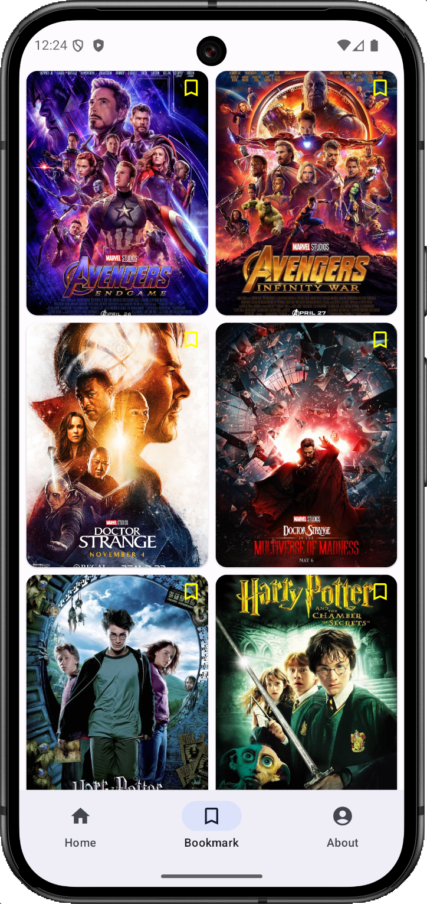

# Movies App

A simple Android app developed as part of the Studi Independent Infinite Learning program. The app displays a list of movies, shows detailed information for each movie, allows users to bookmark their favorites, includes a profile page, and implements a bottom navigation bar.

    
    
    

## 🔧 Implemented Features
- **Movie List**: View a curated list of films.
- **Movie Details**: Tap on any movie to see detailed information.
- **Bookmark Functionality**: Add and remove movies from your bookmarks.
- **Profile Page**: A dedicated screen for user profile information.
- **Bottom Navigation**: Easily navigate between different sections of the app using a bottom navigation bar.

## Credits
This project was created by PeterNex14 as a part of the Infinite Learning Independent Study Program.